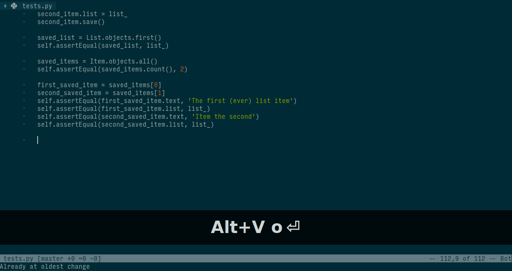

# underscored.vim

## Rationale

We are fans of TDD. We write tests all the times. One of them is written like this:

`def test_do_some_important_stuff_without_breaking_the_other_stuff`

Its nice and readable. But, its hard to type because underscore is hard to reach (at least for standard qwerty keyboard).

With this plugin, not only its easy to read, its also easy to write, by swaping `space` with `_`. 

This plugin is inspired by [vim-capslock](https://github.com/tpope/vim-capslock).

**NOTE:** As you can see from the example above, this plugin primarily aim for languages with snake_case convention, such as python, ruby, etc.

## Installation

Install using any vim plugin manager, or with vim-plug:

    Plug 'pirey/underscored.vim'

Then run `:PlugInstall`

## Usage

Press `<C-G><Space>` in insert mode to swap space to underscore, and press it again to disable it.

## License

Copyright (c) Pirey.  Distributed under the same terms as Vim itself.
See `:help license`.
